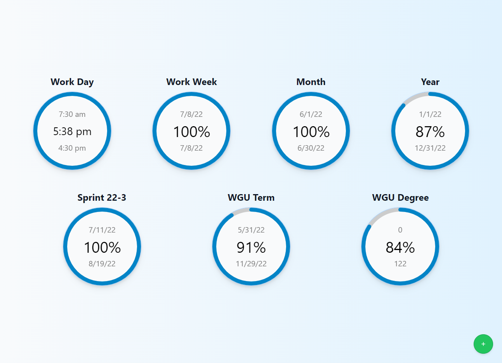
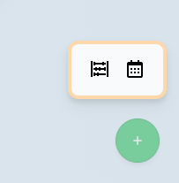
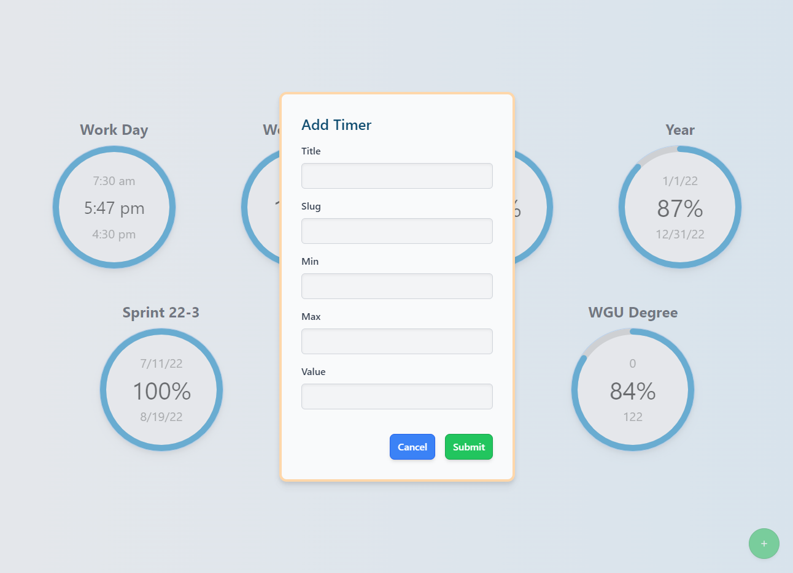
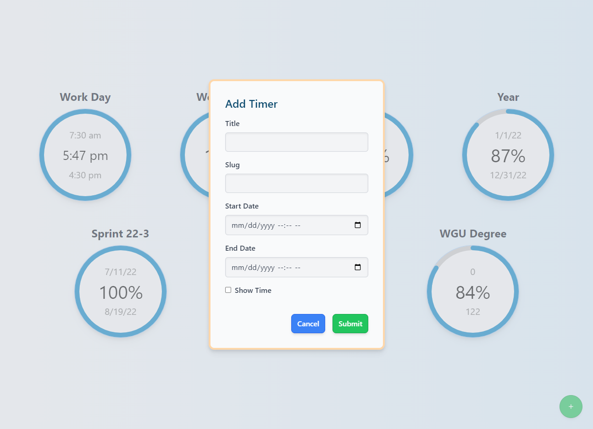

# Progress Monitor

Progress monitor is a web application for visualizing project progress using progress circles/doughnut charts. The application is intended for personal use, so persistence is handled simply through local storage.



## Technology Used
* TypeScript
* React.js
* Next.js
* Tailwind CSS

## Installation

### Prerequisites

The following packages must be present on your system prior to installing and running this application.

1. [Node.js](https://nodejs.org/en/)
2. [npm](https://docs.npmjs.com/cli/init), [Yarn](https://yarnpkg.com/lang/en/docs/cli/create/), or [pnpm](https://pnpm.io)

### Installation/Launching
Install and run this application (in development mode) by running the following commands:

```bash
git clone https://github.com/JoeBradyDev/progress-monitor.git
yarn install
yarn dev
```

Once the server is running, navigate to https://localhost:3000/ to launch the application.

## Usage
When you launch the application, you are immediately brought to the dashboard, which displays all your timers with their progress. See the dashboard image at the top of this file.

### Timer Creation/Editing/Deletion
To create a new progress circle timer, click the green button at the bottom right of the screen. This will bring up a modal with two buttons. The left button will open a form to create a counter timer. The right button will open a form to create a date/time timer.




To edit an existing progress circle timer, click the desired timer. This will bring up a modal with two buttons. The left button will open a form to edit the timer. The right button will immediately delete the timer.

#### Counter Timer Creation/Editing
When creating/editing a counter timer, you are provided the following fields:
* Title: The display name for the timer.
* Slug: The key used to identify the timer.
* Min: The minumum value for the timer.
* Max: The maximum value for the timer.



#### Date/Time Timer Creation/Editing
When creating/editing a date/time timer, you are provided the following fields:
* Title: The display name for the timer.
* Slug: The key used to identify the timer.
* Start Date: The starting date for the timer.
* End Date: The ending date for the timer.
* Show Time Checkbox: If unchecked, the percentage will be displayed on the timer. If checked, the current time will be displayed when the mouse hovers over the timer and the percentage will be displayed when the mouse hovers over the timer.



## Known Issues
This software has various known issues inluding:
* Time often freezes at 4:30 pm.
* Sometimes percentages are shown incorrectly.
* Renaming a timer slug does not work properly.
* If running on a low-end computer, such as a Raspberry Pi, the UI may lag.
* The delete button immediatley deletes the timer.
* Because of the lag on a low-end computer, it is easy to accidentally delete a timer.

## Things To Do Differently
* Create a confirmation modal for timer deletion.
* Turn this into a full-stack application complete with database-based persistence instead of using local storage.
* Use atomic commits with Angular-style descriptive comments during the development of the project.
* Improve accessibility.
* Don't hard-code initial values in local storage. This was done to simplify development for a personal project.
* Use Jest and Cypress for automated testing.

